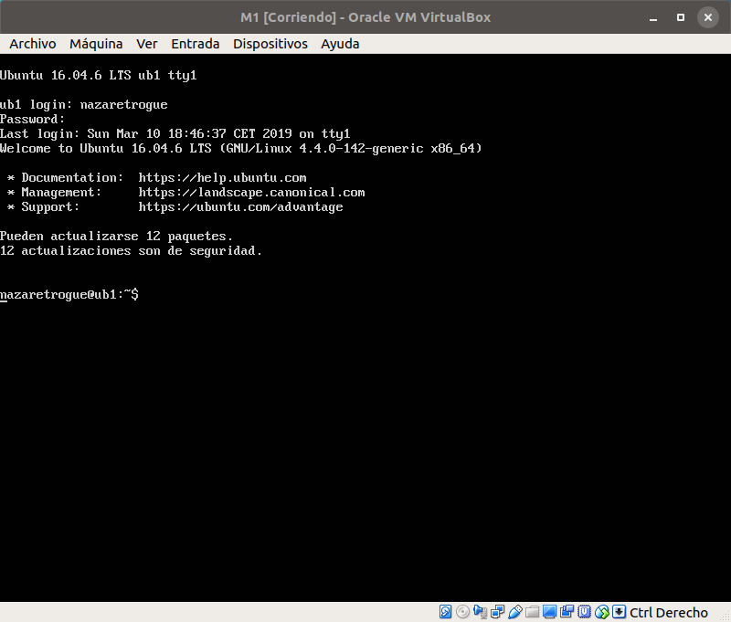
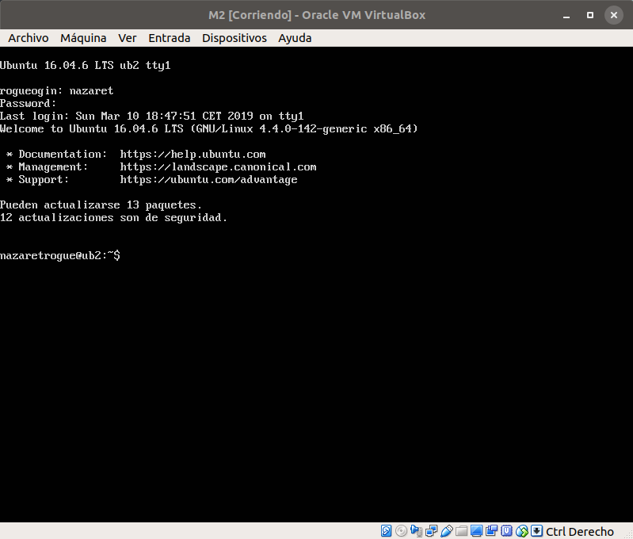

# Instalación

En estas prácticas utilizaré el software de virtualización VirtualBox, ya que
estoy acostumbrada de otras asignaturas en las que la he usado y estoy familiarizada
con su funcionamiento.

Comenzaré con una instalación por defecto de Ubuntu Server 16.04 LTS, con 512MB
de memoria RAM y 8GB de almacenamiento cada máquina. A estas máquinas las llamaré
M1 y M2.

Una vez instaladas, y con ayuda del instalador de la imagen de este S.O., se instalarán
el servicio SSH y la pila LAMP. Las instalaciones finalizadaz y con las máquinas en
funcionamiento se muestran en las imágenes siguientes.

Por el funcionamiento de VirtualBox (no es la primera vez que me pasa), sé que
en el momento de la instalación, ambas máquinas tendrán la misma dirección IP, por
lo que estableceré manualmente y de forma estática la IP de la máquina M1 de
10.0.2.15 a 10.0.2.16 (de forma similar a como hice en las prácticas de
la asignatura Ingeniería de Servidores).
