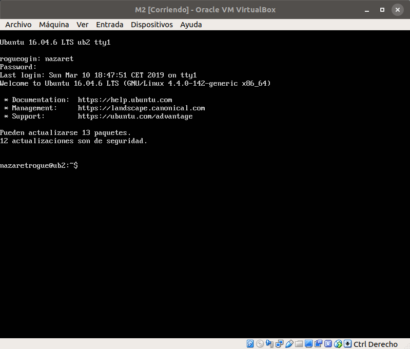
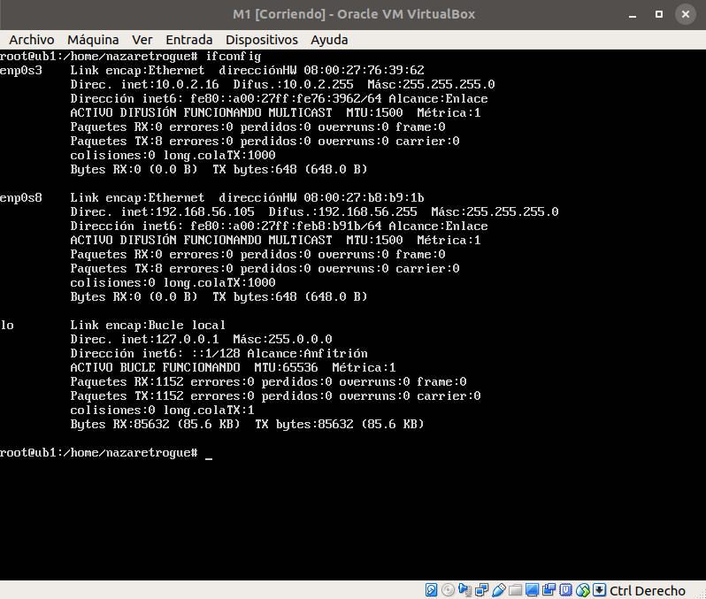

# Configuración de las máquinas M1 y M2

## Instalación

En estas prácticas utilizaré el software de virtualización VirtualBox, ya que
estoy acostumbrada de otras asignaturas en las que la he usado y estoy familiarizada
con su funcionamiento.

Comenzaré con una instalación por defecto de Ubuntu Server 16.04 LTS, con 512MB
de memoria RAM y 8GB de almacenamiento cada máquina. A estas máquinas las llamaré
M1 y M2.

Una vez instaladas, y con ayuda del instalador de la imagen de este S.O., se instalarán
el servicio SSH y la pila LAMP. Las instalaciones finalizadas y con las máquinas en
funcionamiento se muestran en las imágenes siguientes.

Por el funcionamiento de VirtualBox (no es la primera vez que me pasa), sé que
en el momento de la instalación, ambas máquinas tendrán la misma dirección IP, por
lo que estableceré manualmente y de forma estática la IP de la máquina M1 de
10.0.2.15 a 10.0.2.16 (de forma similar a como hice en las prácticas de
la asignatura Ingeniería de Servidores).

## Adaptador e interfaz de red

Para conectar ambas máquinas y que se vean entre ellas, y también con el anfitrión,
es necesario crear una nueva interfaz de red, y para ello, es necesario crear en
VirtualBox un nuevo adaptador de red, entrando en Archivo->Administrador de red
de anfitrión. Se abrirá una ventana como la de la primera imagen, donde podremos
añadir el nuevo adaptador virtual; tras esto, en la configuración de cada máquina
se crea una interfaz solo-anfitrión para que la máquina se conecte con el nuevo
adaptador de red (en la segunda imagen se muestra con la M1; se lleva a cabo el
mismo procedimiento en la M2).

Una vez añadido el adaptador de red, pasamos a cambiar la IP de una de las máquinas
para que ambas no tengan la misma y a añadir la nueva interfaz de red en cada máquina.
Para ello, accedemos al archivo /etc/network/interfaces, donde, como se puede observar
se modifica la interfaz de red enp0s3 en la M1: "inet dhcp" pasa a ser "inet static"
de forma que no se active el protocolo dhcp cada vez que iniciamos la máquina y
se actualice automáticamente la IP nueva que he establecido. De esta manera, la
IP que establezco pasa a ser 10.0.2.16/24 (la primera imagen).

Además, en ambos archivos se puede ver que hay una nueva interfaz de red, la
enp0s8. Esta interfaz es la que se ha utilizado para conectar las máquinas entre
sí y con el host. Como se ha observado en la imagen anterior del adaptador de red
configurado, da soporte al conjunto de direcciones 192.168.56.0/24, así que,
siguiendo la configuración que hice en las máquinas de la asignatura Ingeniería
de Servidores, he utilizado:

+ 192.168.56.105, para M1.
+ 192.168.56.106, para M2.

Por tanto, la configuración final de red mostrada por el comando ifconfig de cada
máquina es:

## Conexión entre M1 y M2

Una vez establecidas, antes de poder conectarlas entre sí, levantamos la conexión
en cada máquina o reiniciamos. Yo he levantado la red con el comando ifup enp0s8
tanto en M1 como en M2. Una vez hecho esto, se comprueba si ambas máquinas se ven
mediante un ping (de M1 a M2 y de M2 a M1 respectivamente).

