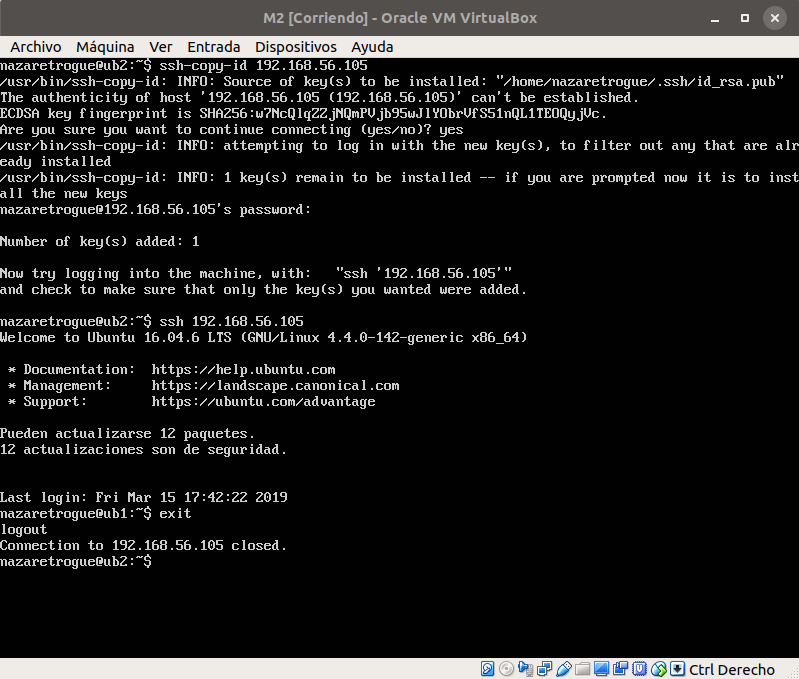
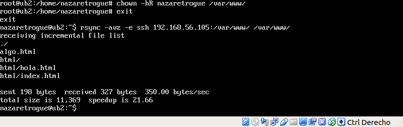
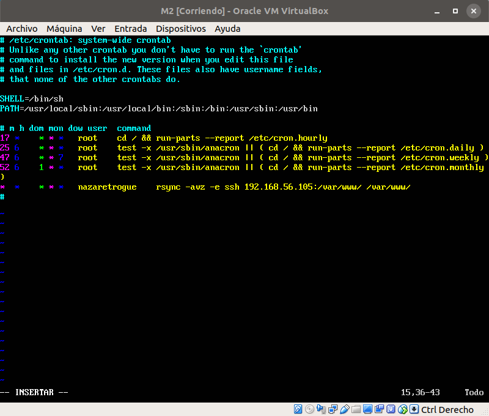

# Sincronización de las máquinas M1 y M2

## SSH sin contraseña

Para poder acceder desde la M2 a la M1 a través del servicio SSH sin que pida
una contraseña, es necesario generar un una clave pública-privada de manera que
la otra máquina nos reconozca sin necesidad de pedir la contraseña de la máquina
a la que se está accediendo.

Para ello, genero una clave en la máquina M2 mediante el comando que sigue:

+ ssh-keygen -b 4096 -t rsa

Este comando significa que se genera una clave SSH con un tamaño de 4096 bits y de
tipo rsa.


Tras generar la clave, hay que copiarla desde la máquina M2 a la máquina M1 con
el comando que sigue, donde la IP dada es la IP de la máquina destino, es decir M1:

```sh
ssh-copy-id 192.168.56.105
```

Una vez copiada, el propio servicio pide que entre a la M1 para comprobar que en
efecto no pide la contraseña, tal y como se ve en la imagen. El procedimiento
funciona y no es necesario introducir la contraseña.



## Prueba del funcionamiento de rsync

Antes de automatizar el proceso de sincronización mediante el demonio cron,
probaré el funcionamiento de rsync de forma aislada.

Para que rsync funcione sobre el directorio /var/www/, es necesario ser propietario
de dicho directorio, ya que no es seguro acceder a través del usuario root del
sistema, que en este momento es el que tiene los permisos sobre dicho directorio.
Para cambiar el propietario se utiliza chown.

Tras esto, pruebo el comando de rsync tal y como se muestra en la imagen. Para ello,
creo un archivo, "algo.html" y también el archivo "hola.html", dentro del directorio
/var/www/html/. De esta forma sabré si el comando funciona tanto con ficheros que
se creen en el propio /var/www/ como en directorios que haya dentro de éste. Los
archivos son transmitidos correctamente, como se muestra en la salida por pantalla
del comando.



## Automatización de la sincronización mediante el demonio cron

Para automatizar, lo único que tengo que hacer es añadir una línea con el comando
que quiero que se ejecute periódicamente en el archivo /etc/crontab, con la
frecuencia que deseo. En este caso, y para comprobar el funcionamiento, la
periodicidad es de un minuto. El archivo queda como sigue:



Por último, para asegurarme de que el comando está funcionando de forma correcta
y que no se genera ningún error, miro en el archivo /var/log/syslog del sistema,
que da lugar a la siguiente salida:


Por lo que está todo correcto ya que no se presenta ningún error.
