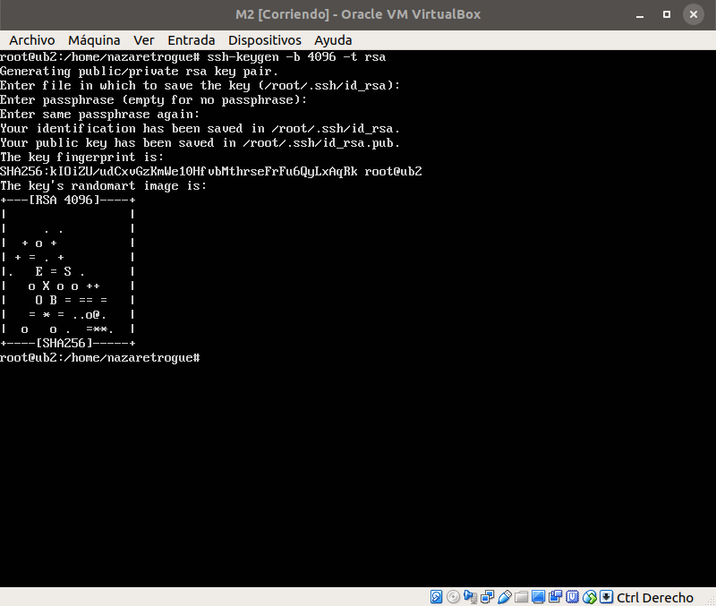

# Sincronización de las máquinas M1 y M2

## SSH sin contraseña

Para poder acceder desde la M2 a la M1 a través del servicio SSH sin que pida
una contraseña, es necesario generar un una clave pública-privada de manera que
la otra máquina nos reconozca sin necesidad de pedir la contraseña de la máquina
a la que se está accediendo.

Para ello, genero una clave en la máquina M2 mediante el comando que sigue:

+ ssh-keygen -b 4096 -t rsa

Este comando significa que se genera una clave SSH con un tamaño de 4096 bits y de
tipo rsa.



Tras generar la clave, hay que copiarla desde la máquina M2 a la máquina M1 con
el comando que sigue, donde la IP dada es la IP de la máquina destino, es decir M1:

```sh
ssh-copy-id 192.168.56.105
```

Una vez copiada, el propio servicio pide que entre a la M1 para comprobar que en
efecto no pide la contraseña, tal y como se ve en la imagen. El procedimiento
funciona y no es necesario introducir la contraseña.


## Prueba del funcionamiento de rsync
