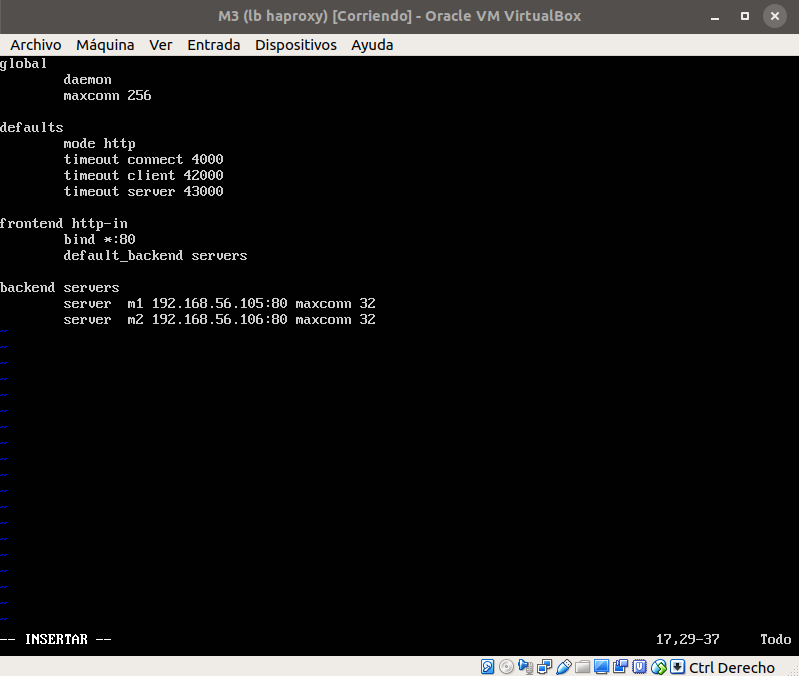

# Balanceo de carga

## Configuración de **_nginx_**

Para poder configurar el balanceador de carga con *nginx*, he utilizado una máquina
diferente a las dos máquinas que actuan como servidores. La he llamado
M3 (lb nginx), es decir load balancer usando *nginx*.

Para esta máquina no he instalado la pila LAMP, ya que no debe tener el servicio
de apache activo y ocupando el puerto 80. Además, la IP de esta máquina es:

+ 192.168.56.107/24


Una vez que tengo la configuración de la máquina para que se vea con las demás,
configuro el servicio de balanceo que va a ofrecer esta máquina. Para ello, lo
primero es instalar *nginx*:

```sh
sudo apt-get install nginx
```

Tras esto, compruebo que está funcionando:

```sh
systemctl start nginx
systemctl status nginx
```


Tras ver que *nginx* está funcionando correctamente, modifico el archivo de configuración
para que balancee los servidores M1 y M2. Para ello se accede al archivo mediante:

```sh
vi /etc/nginx/conf.d/default.config
```

El archivo queda tal y como se muestra en la imagen, con las IPs de los servidores
en la parte upstream apaches:


Además, hay que cambiar otro archivo, el /etc/nginx/nginx.conf, para asegurarnos
que *nginx* no actúa como otro servidor más, sino como balanceador. Para ello,
se comenta la línea previa a la sección mail:

```sh
#include /etc/nginx/sites-enabled/*;
```


Tras estos cambios, se puede probar si de verdad está funcionando como balanceador;
para ello, utilizo el comando curl con la IP del balanceador. La salida es la siguiente:


Que demuestra que, en efecto, está actuando de balanceador.

## Configuración de **_haproxy_**

De manera análoga a como lo he hecho con *nginx*, lo haré con *haproxy*. Comienzo con
una instalación, en una cuarta máquina (con el nombre de M3 (lb haproxy)), sin
apache, con la misma IP que la máquina con *nginx*:

+ 192.168.56.107/24


Tras esto, instalo el servicio de *haproxy*, igual que con *nginx*.

```sh
sudo apt-get install haproxy
```

Cuando se ha acabado de instalar, hay que cambiar (o crear) el archivo de configuración
para que balancee la carga. Para ello, se accede al archivo /etc/haproxy/haproxy.cfg
que queda de la siguiente forma:


Tras esto, lanzamos el balanceador con el comando:

```sh
sudo /usr/sbin/haproxy -f /etc/haproxy/haproxy.cfg
```

No obstante, al ejecutar este comando con el fichero tal y como lo he escrito, hay
tres errores, como se muestran en la imagen:


Los errores se basan en un error de directivas obsoletas; de modo que cambiando
los errores que se muestran y lanzando de nuevo el servicio, todo funciona correctamente
y sin errores:




Al igual que con *nginx*, comprobamos ahora que balancea la carga entre los servidores
con el comando curl:


Y como es evidente, funciona.

## Someter a alta carga al servidor balanceado con **_ab_**

En este apartado, utilizaré **_ab_** (**_apache benchmark_**) para sobrecargar
el servidor balanceado.

### Nginx como servidor balanceado

Para testar como reacciona *nginx* ante una gran carga, llevaré a cabo dos
experimentos. Para comprobar el estado de cada máquina, usaré *htop*, un monitor
del sistema por línea de comandos pero que ofrece una interfaz con colores, donde
muestra la carga de la CPU, la memoria y el area de intercambio principalmente.

Mediante el comando

```sh
ab -n 100000 -c 10 192.168.56.107
```

envío 100000 peticiones con una concurrencia de 10 a la máquina dada por la IP.
La carga de cada máquina es la que sigue (M3, M1 y M2 respectivamente):


Como se puede comprobar, la CPU del balanceador está casi al 100%, mientras que
en las máquinas M1 y M2, la carga está repartida equitativamente, por lo que el
uso de la CPU es similar entre ambas máquinas.

### Haproxy como servidor balanceado

Al igual que acabo de hacer con *nginx*, lo haré con *haproxy*; utilizaré las
mismas herramientas, tanto **_ab_** como *htop*.

De nuevo, con el mismo comando que previamente he mencionado, lanzaré 100000
peticiones al balanceador, con una concurrencia de 10 (es decir, de 10 en 10).
El resultado de cada máquina (M3, M1 y M2, en este orden) es:


Al igual que antes, el balanceador tiene la CPU al 100%, mientras que las máquinas
servidoras tienen las peticines repartidas, de forma que ambas tiene la CPU
más o menos a la mitad de su capacidad.
