# Asegurar la granja web

## Instalar un certificado SSL autofirmado

Primero generaré el certificado en la máquina M1, y después este certificado será
copiado con _rsync_ a M2 y al balanceador de carga.

Para generar el certificado, se necesita utilizar la herramienta de apache2 que
habilita módulos, _a2enmod_, con la que habilitaremos SSL:

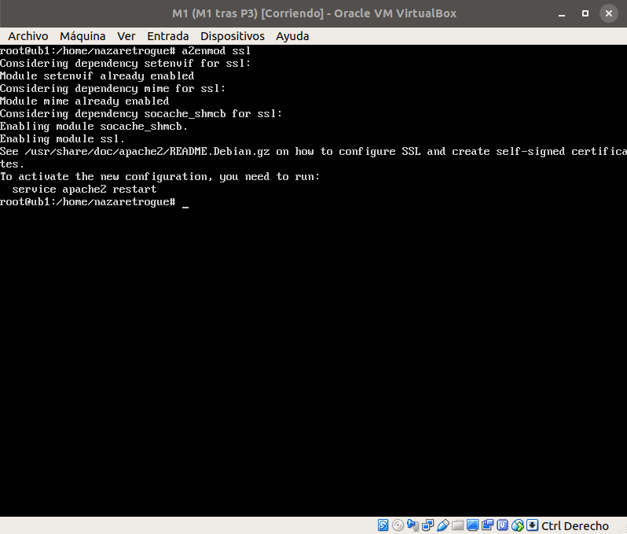

Una vez habilitado, reinicio el servicio y creo un directorio en /etc/apache2
para situar dentro los archivos que se generarán durante la creación del certificado:

```sh
service apache2 restart
mkdir /etc/apache2/ssl
```

Ahora genero el certificado x509, con una clave de 2048 bytes, válida durante 1 año.
Durante la generación, pide una serie de datos como el país, la provincia y localidad, la organización y un correo electrónico:

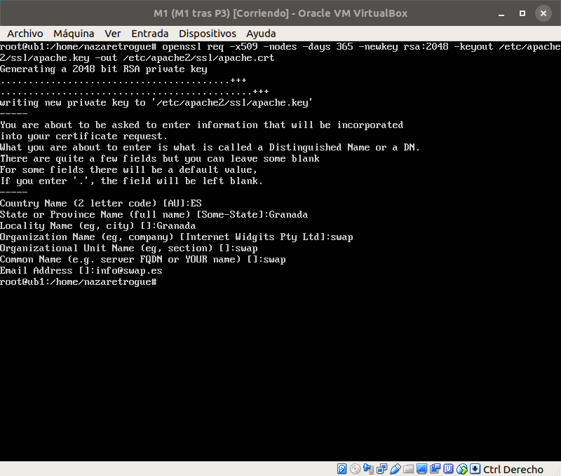

Tras generarlo, hay que modificar el archivo de configuración del sitio y añadir dos líneas:

```ssh
SSLCertificateFile /etc/apache2/ssl/apache.crt
SSLCertificateKeyFile /etc/apache2/ssl/apache.key
```

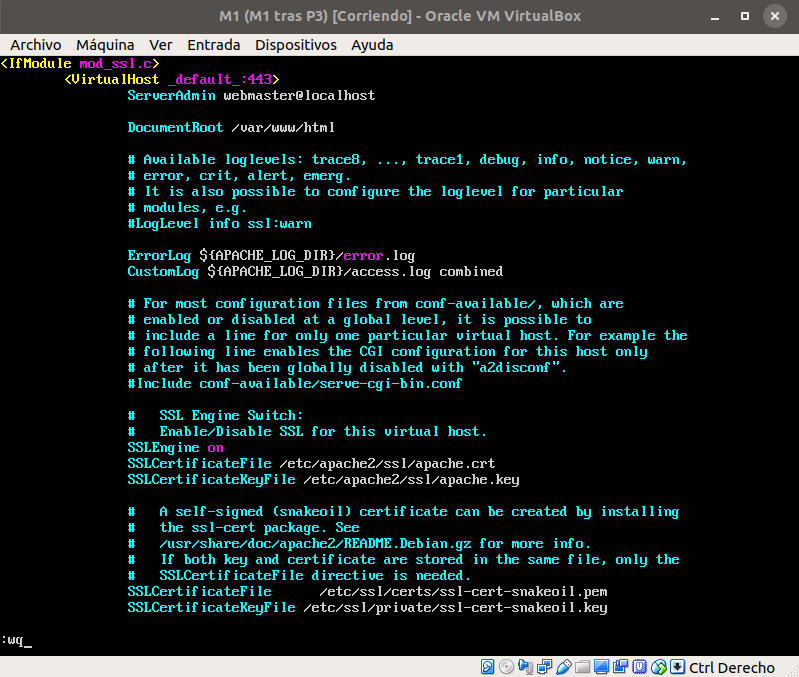

Tras esto, activo el sitio y reinicio apache:

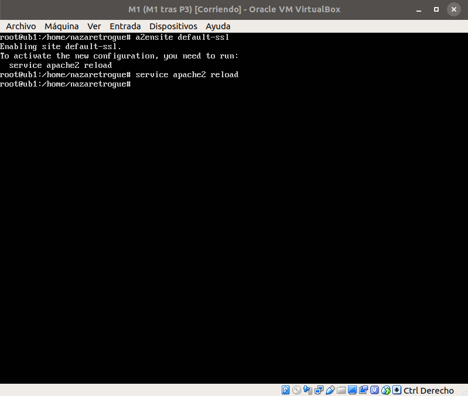

Una vez hecho esto, comprobamos si efectivamente está funcionando correctamente:

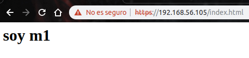
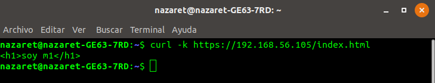

Una vez hecho esto en la M1, para M2 se clona la M1 y se cambia la IP para dejar la
máquina con la misma configuración que tenía anteriormente (al clonar, el nombre y
la IP cambian y quedan iguales a M1, por lo que hay que reconfigurar).

Para cambiar el nombre de la máquina, se modifican los dos archivos siguientes y
se pone el nombre que se desee en ellos:

```sh
vi /etc/hosts
vi /etc/hostname
```

Tras hacer esto, compruebo si M2 funciona, con la misma prueba que he utilizado para
M1: accediendo a la página con el navegador del host y con curl:

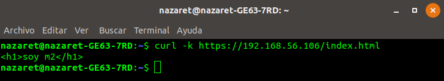
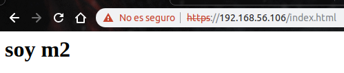

Por último, configuraré el balanceador de carga (M3) de forma que la granja entera
acepte peticiones por HTTPS y el balanceador reparta correctamente el tráfico.

Para esto, utilizo _rsync_ y copio los archivos en un nuevo directorio dentro del
home, ya que si lo pusiera en /tmp como el guión, se eliminaría al apagar la máquina.
El funcionamiento de _rsync_ es el que sigue:

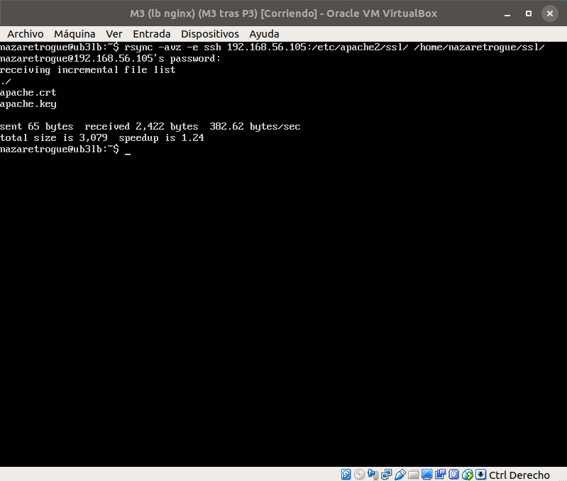

Tras esto, modificamos el archivo de configuración de **_nginx_** para que el balanceador
escuche en el puerto 443, el de HTTPS.

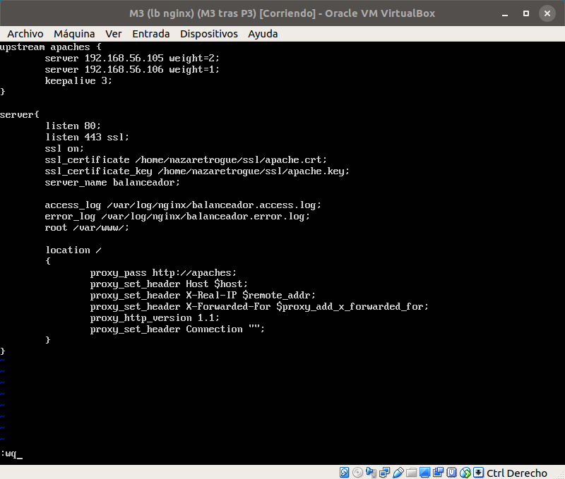

Tras esto, y mediante el comando curl, comprobamos que el balanceador está repartiendo
correctamente el tráfico HTTPS entre las máquinas. Hay que destacar que el balanceador
está configurado mediante ponderación, con la M1 supuesta el doble de potente que M2,
motivo por el cual el reparto no es equitativo.

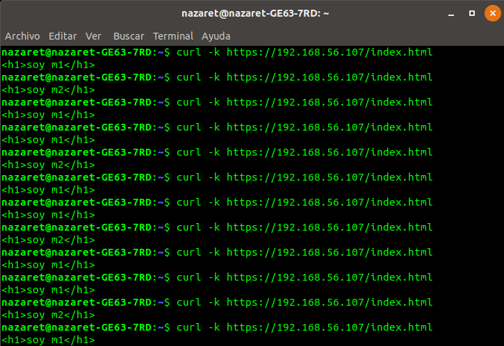

## Configuración del cortafuegos

Después de configurar las máquinas para que acepten tráfico desde el puerto 443,
ahora hay que configurar el cortafuegos para filtrar el tráfico que pasa por la
granja web. Será configurado con _iptables_.

Para ello, después de hacer las pruebas para aprender a usarlo, creo un script
que será ejecutado al arrancar la máquina, de manera que, al iniciarla, se configure
automáticamente el cortafuegos.

Lo primero que haré será crear y activar un demonio que ejecutará el script al
arrancar. Dicho demonio estará en /etc/systemc/system/ con el nombre de
**iptables-config-init.service**.

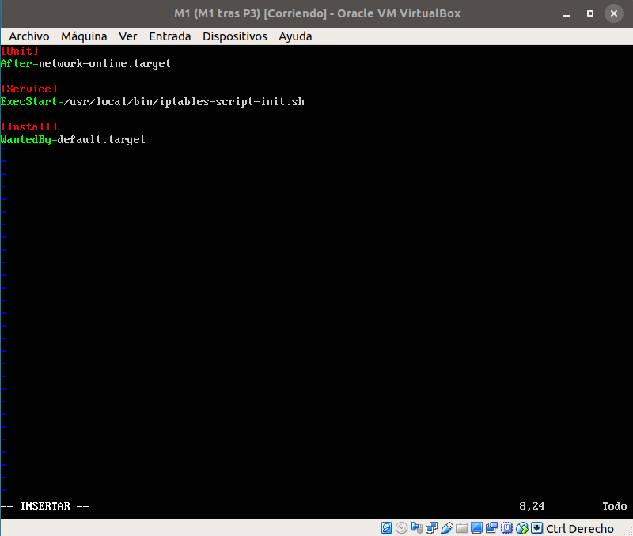

Una vez configurado, creo el script que ha de ejecutarse y cuya ruta absoluta
es la que le he dado en ExecStart. Es decir, el script estará en /usr/local/bin/
y su nombre será **iptables-script-init.sh**.

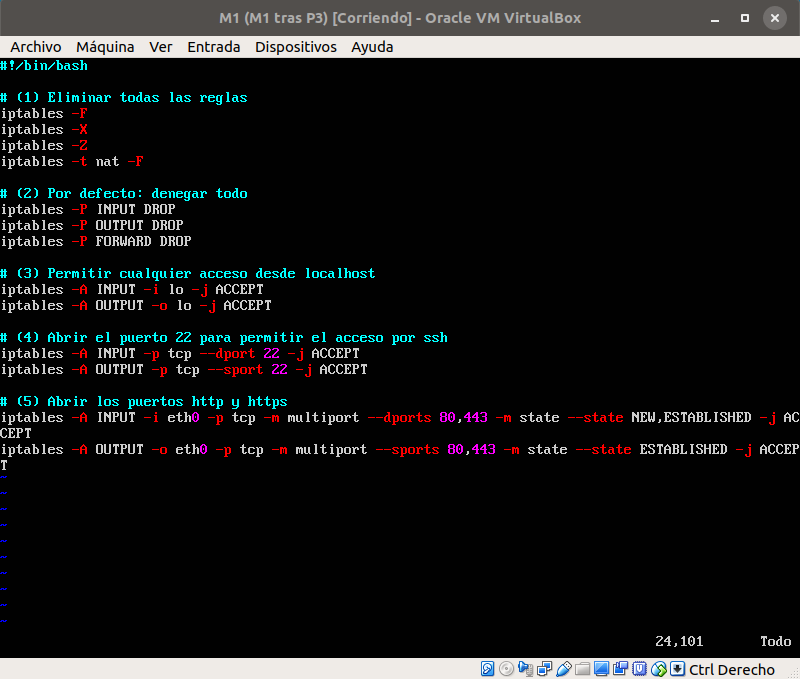

Una vez están listos ambos archivos, activo y lanzo el demonio con los comandos

```sh
systemctl daemon-reload
systemctl enable iptables-config-init.service
```

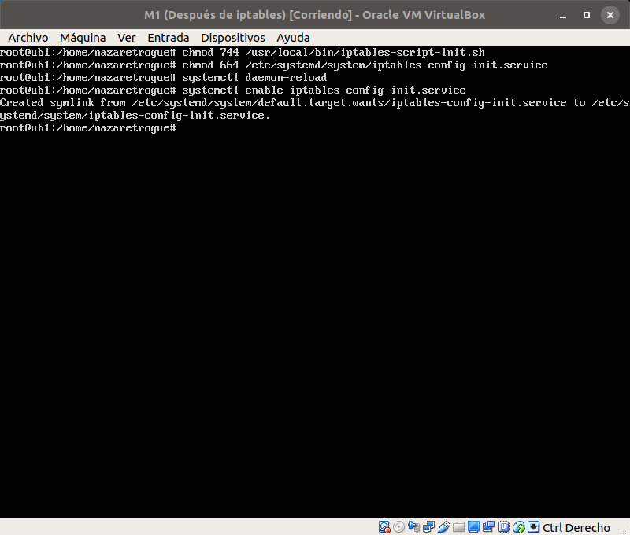

Una vez está el demonio activo, solo hay que reiniciar la máquina para comprobar
que está llevando a cabo la configuración. Tras reiniciar, se comprueban los puertos
que están escuchando y la configuración del cortafuegos.

Primero vemos que los puertos están correctos:

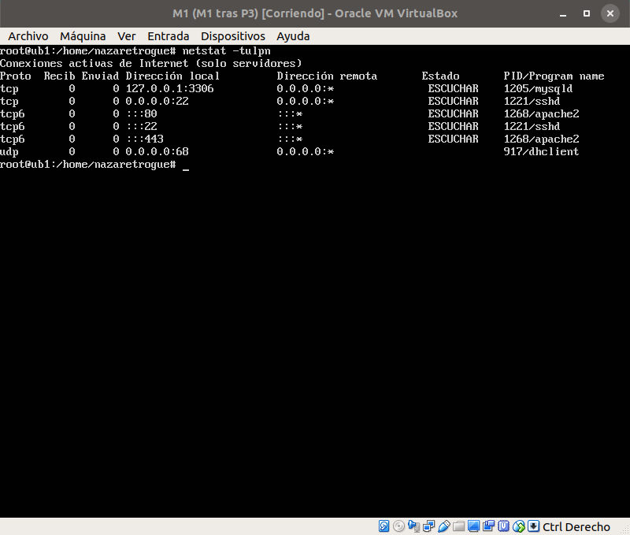

Ahora vemos que el cortafuegos está bien configurado:

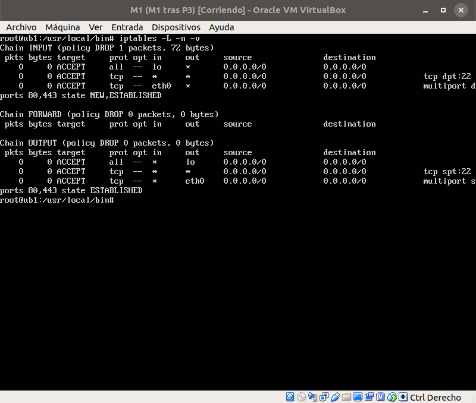

Como se ha demostrado, todo funciona correctamente y las máquinas son capaces de
recibir y de enviar tráfico de forma segura en la granja.
