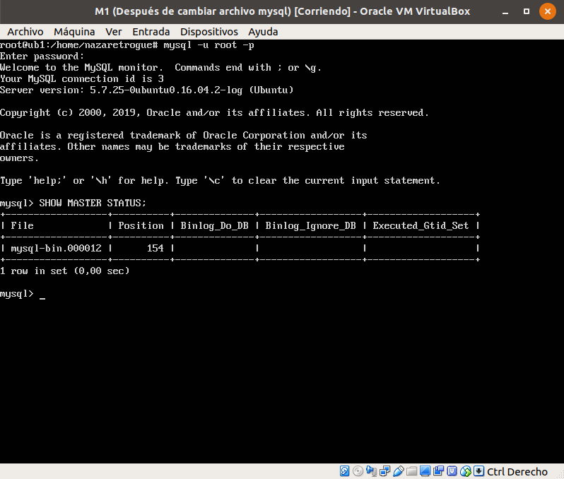
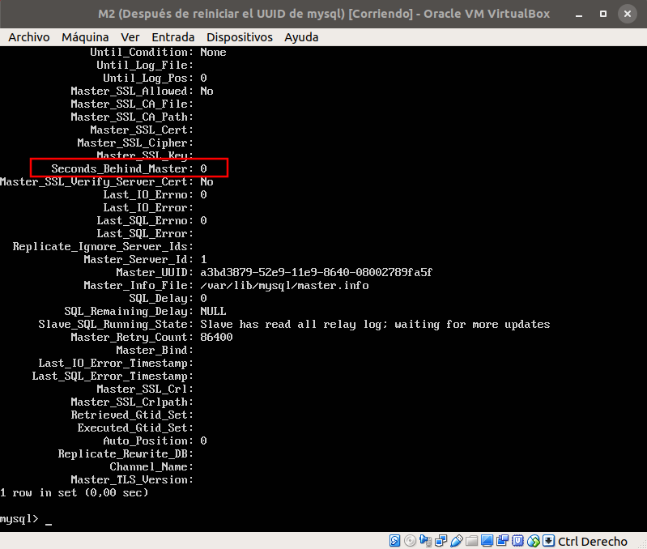
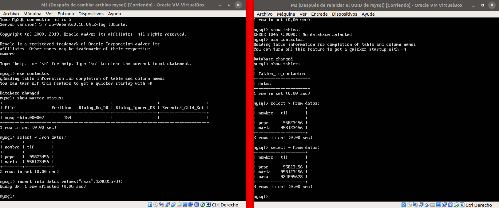

# Replición de bases de datos MySQL

## Creación de la base de datos e inserción de datos

El primer paso es crear la base de datos que voy a utilizar, en este caso llamada
*contactos*; la base de datos deberá ser creada a mano en ambos servidores ya
que en el siguiente paso, usando *mysqldump*, la base datos no será creada como tal,
debe estar creada de antemano. En la siguiente imagen se muestra como se ha creado
en la máquina principal (M1) y la de backup (que será el esclavo, M2).


Tras esto, en la máquina principal se crea la tabla y se insertan datos, tal y
como muestra la siguiente captura:


Una vez insertados los datos, hay que bloquear las tablas para copiarlas, de forma
que no haya nuevas escrituras mientras se produzca el traspaso de datos y se produzcan
discrepancias entre ambas tablas.


## Replicar una BD MySQL con *mysqldump*

Una vez hecho esto, se genera el archivo que voy a copiar en la otra máquina mediante
*mysqldump*:

```sh
mysqldump contactos -u root -p > /tmp/contactos.sql
```

Una vez creado, ya se pueden desbloquear las tablas que previamente se habían bloqueado
para evitar nuevas escrituras:


Ahora, en la máquina de backup, se copia el archivo mediante *scp* tal y como 
muestra la imagen que sigue:


Tras la copia, se ejecutan las sentencias sql del archivo en la base de datos de
la máquina de backup. Para eso utilizo el comando que se muestra en el imagen, que
abre mysql y vuelca el contenido del archivo en la base de datos especificada, en
este caso, contactos:


Una vez hecho esto, se comprueba si ambas tablas son iguales, y en efecto, lo son.

## Replicar una BD MySQL a mano

Aunque no es la mejor opción a la hora de replicar la información en una granja web
real, también se puede llevar a cabo la replicación a mano, es decir, escribiendo
las mismas sentencias en ambas máquinas de forma paralela.


Esta opción presenta muchas desventajas, como por ejemplo fallos, olvidos, mayor
inversión de esfuerzo y dinero (ya que debe haber un operario que se dedique 
exclusivamente a esto) e inviabilidad cuando las consultas crecen a una velocidad 
muy grande.

## Configuración maestro-esclavo

Para llevar a cabo esta configuración, lo primero que se debe hacer es modificar
los archivos de configuración del maestro y del esclavo, de manera que se pueda
establecer correctamente la sincronización entre ambas máquinas.

Para ello, hay que comentar la dirección en la que están escuchando los servicios
de mysql en ambas máquinas, que por defecto es localhost (recuadro rojo):


Una vez comentado este parámetro, hay que indicar los archivos donde se llevará
el registro de errores y el de log; además hay que establecer un id para cada
uno (las líneas modificadas están recuadradas en rojo):


Tras modificar los archivos, reinicio los servicios y compruebo si hay errores.
Si al reiniciar todo está correcto, puedo comenzar a configurar el maestro y el
esclavo.


Ahora se configura cada máquina por separado.

### Configuración del maestro

Una vez reiniciado, dentro del maestro, introducimos los siguientes comandos:

+ Creación de un usuario *esclavo*:
~~~~sql
CREATE USER esclavo IDENTIFIED BY 'esclavo';
~~~~

+ Dar permiso al esclavo de replicación:
~~~~sql
GRANT REPLICATION SLAVE ON *.* TO 'esclavo'@'%' IDENTIFIED BY 'esclavo';
~~~~

+ Eliminar privilegios y eliminar la posibilidad de escritura en tablas mientras
se crea el maestro:

~~~~sql
FLUSH PRIVILEGES;
FLUSH TABLES;
FLUSH TABLES WITH READ LOCK;
~~~~

Una vez hecho esto, se comprueba el estado del maestro:

~~~~slq
SHOW MASTER STATUS;
~~~~

Con este último comando, aparece algo como lo siguiente, que nos muestra
el nombre del fichero y la posición:



Después de hacer la configuración en el maestro, haré la configuración en el 
esclavo.

### Configuración del esclavo

Para configurar al esclavo hay que introducir un único comando que enlaza el
esclavo con el maestro. La instrucción es:

~~~~sql
CHANGE MASTER TO MASTER_HOST='192.168.56.105', MASTER_USER='esclavo',
MASTER_PASSWORD='esclavo', MASTER_LOG_FILE='mysql-bin.000012',
MASTER_LOG_POS=154, MASTER_PORT=3306;
~~~~

Tras establecer el maestro, se inicia al esclavo y se muestra el estatus de éste
para comprobar que todo ha ido correctamente y no ha habido fallos. Hay que fijarse
en la variable *Seconds/_behind/_master*; si es distinta de *NULL*, la configuración
es correcta. Como se puede comprobar en la captura, el valor es 0, es decir que
la configuración está bien.



Una vez que se ha comprobado esto, se prueba a modificar el maestro; los cambios
se deben ver reflejados en el esclavo. Para ello, se muestra primero el contenido
original en el esclavo, se hace la inserción en el maestro y se vuelve a mostrar
el contenido de la tabla en el esclavo.



Como podemos comprobar, en efecto, la información se replica correctamente.


