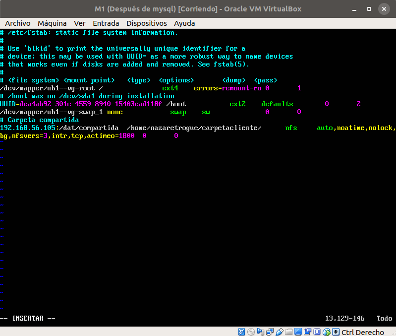

# Servidor de disco NFS

## Configurar el servidor NFS

Para poder configurar el servidor (M1) primero es necesario instalar los paquetes necesarios
con el comando

```sh
sudo apt-get install nfs-kernel-server nfs-common rpcbind
```

Una vez instalado, paso a configurar el directorio que será compartido por los clientes;
para ello, se crea el directorio, se establece el propietario y se dan los permisos
necesarios, tal y como muestra la imagen:


Una vez configurado, se indica qué máquinas podrán acceder al directorio, modificando
el archivo */etc/exports* y añadiendo la línea que se muestra en la captura siguiente:


Tras modificar el archivo, reiniciamos el servicio.

```sh
sudo service nfs-kernel-server restart
```

## Configurar los clientes

Una vez configurada la máquina M1 como servidor, configuraré los clientes en las
máquinas M1 y M2. Los pasos mostrados en las imágenes y las explicaciones son
análogas a la máquina M1, ya que todo lo que muestre lo habré hecho en la M2, pero
será igual en M1.

Primero se instalan los paquetes necesarios (en este caso, se hace solo en M2 ya
que en M1 se ha instalado todo a la vez).


Como prueba inicial para comprobar el funcionamiento, montaré el directorio de
forma provisional. Para ello, creo el directorio en el que se guardará la información,
se darán permisos y luego se montará, tal y como se muestra en la imagen:


Cuando ya se ha configurado todo, se comprueba que se puede acceder al directorio
y se puede escribir en él:


Ahora, en el directorio de M1 se comprueba que aparece el archivo recién creado
en M2:


## Automatización del montado

Por último, habiendo comprobado que funciona correctamente, automatizaré el montado
del sistema de archivos en el directorio. Para ello, tanto en la M1 como en la
M2 se modificará el archivo */etc/fstab*, añadiendo la línea que se muestra a
continuación:



Una vez modificado en ambas máquinas, reiniciamos y hacemos de nuevo la prueba para
demostrar el correcto funcionamiento del NFS:


Y, como se puede observar, funciona correctamente.
