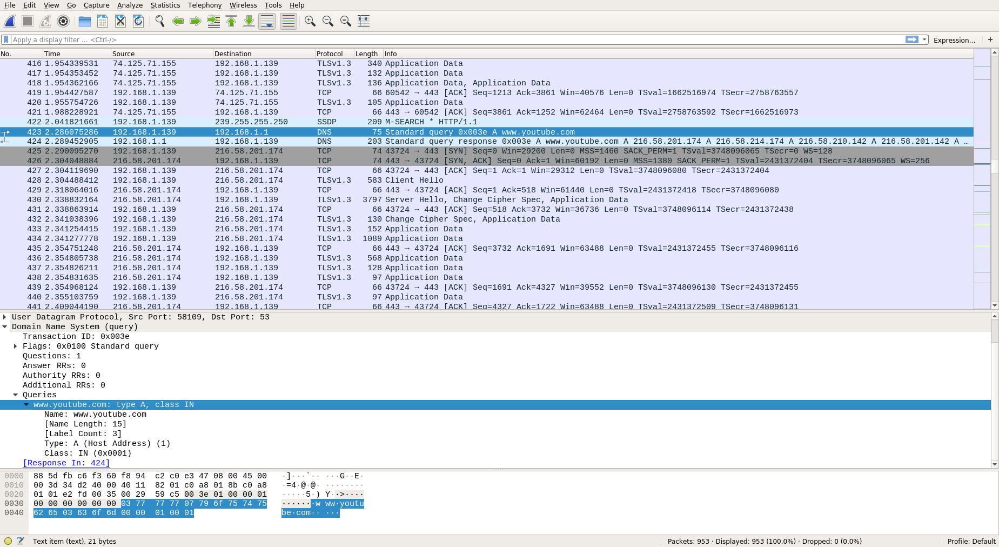
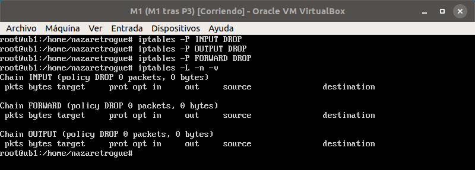
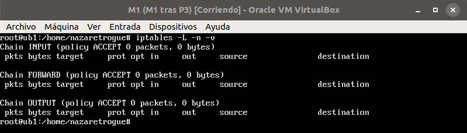
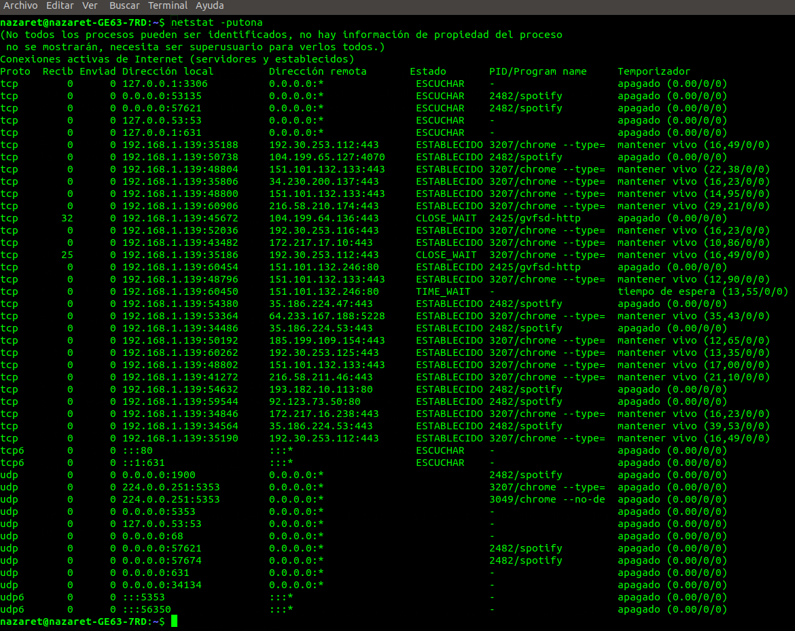

# Tema 1

## Ejercicio 1
Buscar información sobre las tareas o servicios web para los que se usan más los programas
que comentamos al principio.

+ **Apache**: este servicio es usado principalmente para servir páginas web (ya
    sean estáticas o dinámicas).
+ **nginx**: inicialmente fue creado para servir páginas web estáticas para sitios
    web con mucho tráfico, ya que ocupa mucha menos memoria que *apache*. No obstante
    también se utiliza como un potente balanceador de carga y como un proxy para
    protocolos de correo eléctrónico (como *IMAP*/*POP3*).
+ **thttpd**: es un servidor web ligero, rápido y seguro que se utiliza para servir
    grandes volúmenes de información estática, al igual que *nginx*. Se usa con la
    intención de aumentar la velocidad de transferencia de achivos y reducir el
    uso de recursos.
+ **Cherokee**: servidor web rápido y ligero, utilizado para servir peticiones web;
    al igual que *nginx*, también se utiliza como balanceador de carga. Puede ser
    utilizado en sistemas embebidos o en grandes CPDs gracias a que es multiplataforma
    y soporta una gran cantidad de complementos para aumentar y mejorar su funcionalidad.
+ **Node.js**: es un entorno en tiempo de ejecución creado para poder crear programas
    muy escalables (como servidores web) aunque no se limita solo a eso. Aporta
    flexibilidad y es muy rápido.

# Tema 2

## Ejercicio 1
Calcular la disponibilidad del sistema si tenemos dos réplicas de cada elemento (en total
3 elementos en cada subsistema).

Componente | A<sub>n</sub> | A<sub>n-1</sub> | Resultado
-----------|---------------|-----------------|----------
Web | 0.9775 | 0.85 | 0.99662
Aplicación | 0.99 | 0.9 | 0.999
Base de datos | 0.999 | 0.9999 | 1
DNS | 0.9996 | 0.98 | 0.99999
Cortafuegos | 0.9775 | 0.85 | 0.99662
Switch | 0.9999 | 0.99 | 1
Data Center | 0.9999 | 0.9999 | 1
ISP | 0.9975 | 0.95 | 0.99987
\- | - | **Total** | 0.99214

## Ejercicio 2
Buscar frameworks y librerías para diferentes lenguajes que permitan hacer aplicaciones
altamente disponibles con relativa facilidad.

+ **PM2**: es un administrador de tareas que permite mantener, creado sobre un
    balanceador de carga que permite mantener activas las aplicaciones con una
    altísima disponibilidad y que facilita el trabajo de los administradores de
    sistemas.
+ **Vaadin**: es una plataforma para aplicaciones web que incluye un conjunto de
    componentes, entre los que está un framework de Java para web, que ayuda al
    mantenimiento de la disponibilidad de las aplicaciones hospedadas en la
    plataforma. Es sencillo de usar y está pensado especialmente para principiantes.
+ **Sprint MVC**: es una buena alternativa a *Vaadin*; altamente escalable, permite
    una disponibilidad de los servicios alta y tiene una gran cantidad de documentación.
    Pero, a diferencia de *Vaadin*, mantener el código con este framework es bastante
    más complejo y puede ser difícil para alguien recién iniciado.

## Ejercicio 3
¿Cómo analizar el nivel de carga de cada uno de los subsistemas en el servidor? Buscar
herramientas y aprender a usarlas.

Para poder medir el nivel de carga de cada subsistema en un servidor, se utilizan
los llamados *profilers*, monitores que se centran en analizar el nivel de carga
de los distintos componentes. También existen los monitores que analizan el tráfico
del sistema al completo (como el monitor *sar*, que se basa en dos órdenes
complementarias, *sadc*, que recopila datos, y *sar*, que traduce dichos datos a
un formato legible y entendible.) Entre los *profilers*, destacan:

+ **gprof**: un monitor fácil de utilizar, que da el uso de CPU de un programa.
    Para utilizarlo, es necesario instrumentar el programa en la compilación
    para poder recoger datos, y tras conseguirlos, analizarlos.
+ **Perf**: esta herramienta ofrece la posibilidad de analizar muchos más componentes
    según las necesidades del servidor. Está basado en eventos hardware y software
    y posee una gran cantidad de comandos según lo que se vaya a analizar.
+ **V-Tune**: al igual que *Perf*, está basado en eventos y soporta tanto eventos
    hardware como software. También se puede utilizar como depurador y es capaz
    de medir el rendimiento de cada componente que se analice.

Estos son solo tres de las decenas de herramientas que existen para monitorizar
todo tipo de tráfico tanto en el sistema en conjunto, como por componentes, etc.

## Ejercicio 4
Buscar ejemplos de balanceadores software y hardware (productos comerciales). Buscar
productos comerciales para servidores de aplicaciones. Buscar productos comerciales
para servidores de almacenamiento.

### Hardware

+ **F5 Networks Big/IP**: uno de los productos más conocidos para balanceo de
    carga con hardware. Este dispositivo está contenido en un rack, listo para
    ser montado en un armario, y posee software específico de forma que realiza
    la carga de forma eficiente.
+ **Cisco Load Balancer**: la metodología de Cisco consiste en crear routers que
    directamente actúan como balanceadores, de forma que no tiene que disponer de
    hardware distinto al que acostumbran. De esta forma, crean balanceadores de
    carga hardware con una tecnología que dominan y dan lugar a dispositivos
    pequeños y manejables pero potentes y eficientes.
+ **Kemp Technologies**: han creado un balanceador de carga al alcance de todos
    (barato en comparación con los existentes) pero que tiene una potencia similar
    o mínimamente inferior, aunque los consumidores de estos aún creen que necesitan
    algo más de experiencia en el mercado para crear balanceadores capaces de
    soportar una mayor funcionalidad.

### Software

+ **Seesaw**: usado por Google, ha demostrado ser un software de balanceo eficiente
    para redes en la capa de transporte. En el caso de tener redes que se quieran
    balancear en capa 7, quizá ésta no sea la mejor opción.
+ **LoadMaster**: balanceador de carga por software creado por *Kemp*; es gratuito
    y con gran funcionalidad. Soporta balanceo en capa 4 y capa 7, incluye un
    cortafuegos para aplicaciones web, persistencia de cookies, tunneling, etc.
+ **HAProxy**: uno de los más populares, da lugar a alta disponibilidad, proxy,
    y el propio balanceo de carga. Lo utilizan grandes sitios como GitHub o Reddit.

# Tema 3

## Ejercicio 1
Buscar con qué órdenes de terminal o herramientas podemos configurar bajo Windows y bajo
Linux el enrutamiento del tráfico de un servidor para pasar el tráfico desde una subred a otra.

Para Windows existe un comando para añadir rutas estáticas en la tabla de enrutamiento
para poder pasar el tráfico de una red a otra a través de una default gateway;
este comando es

```sh
route ADD [destino] MASK [mascara] [gateway] [metrica]
```

Uno muy similar existe en Linux, con una sintaxis similar. Es el siguiente:

```sh
route add -net [destino] netmask [mascara] gw [gateway]
```

Con estos comandos se añaden rutas estáticas que permiten redirigir el tráfico
de una subred a otra estableciendo una gateway por defecto por la que saldrá el
tráfico.

## Ejercicio 2
Buscar con qué órdenes de terminal o herramientas gráficas podemos configurar bajo Windows
y bajo Linux el filtrado y bloqueo de paquetes.

Para Windows existe un framework muy potente para el filtrado de paquetes que
ayuda a filtrarlos de forma transparente para el usuario. Éste es el **Windows Packet
Filter** (**WinpkFilter**). Está disponible para sistemas a partir de Windows 95
en adelante.

Para Linux se utiliza el comando *iptables*, con sus muchas opciones para poder
configurar el firewall del kernel y filtrar los paquetes. Con esta herramienta
se puede configurar los puertos que están abiertos y cerrados, qué IPs tienen
el paso abierto y cuáles no, se puede llevar a cabo redirección a través
de esta herramienta... Es un comando muy potente y capaz de hacer maravillas con
el firewall.

# Tema 5

## Ejercicio 1
Buscar información sobre cómo calcular el número de conexiones por segundo.

Hay muchas formas de calcular el número de conexiones que hay abiertas en un servidor.
Por ejemplo, podemos utilizar la herramienta *netstat* con el siguiente comando:

```sh
netstat | grep http | wc -l
```

Al ejecutar este comando, la salida será un número que corresponde al número de
conexiones que hay en el puerto 80, es decir, el número de conexiones http que
hay en el momento en el que se ejecuta. *wc -l* nos indica el número de líneas de
la salida de *netstat* que hemos filtrado para que nos muestre solo las conexiones
http.

Otra forma es con el servicio que estemos usando; tanto *Apache* como *nginx* tienen
la capacidad de mostrar las conexiones que tienen abiertas. Con *nginx* solo hay
que cambiar el archivo de configuración para indicarle que muestre el número de
conexiones (o que se redirija a un archivo para llevar la cuenta si queremos automatizar
el proceso cada cierto tiempo). De manera similar, utilizando un módulo en *Apache*
podemos conseguir el número de conexiones que hay activas.

## Ejercicio 2
Instalar Wireshark y observar cómo fluye el tráfico de red en uno de los servidores web
mientras se le hacen peticiones HTTP... o en la red de casa.

En nuestro caso, utilizaremos el wireshark para analizar el tráfico cuando se
hace una petición a google de acceso a youtube.



Como podemos ver en la imagen, la traza marcada es la que inicia el comienzo de 
la búsqueda de youtube. Para ello, el ordenador pide al DNS que resuelva la dirección
IP del nombre de dominio *www.youtube.com*. El DNS responde con la IP del servidor
y a partir de ese momento, comienza el intercambio de mensajes.

Los primeros mensajes corresponden con el *handshake*, una serie de mensajes que
se envian ambas partes para negociar cómo será la seguridad en los mensajes que se
enviarán después. Es un paso muy importante ya que previene y dificulta que se
produzcan ataques en la comunicación entre el servidor y el cliente.

Tras este *handshake*, el cliente comienzará a hacer peticiones sobre contenido que
desea y el servidor del youtube al que está conectado se encargará de enviar las
respuestas a dichas peticiones.

# Tema 6

## Ejercicio 1
Aplicar con iptables una política de denegar todo el tráfico en una de las máquinas de
prácticas. Comprobar el funcionamiento. Aplicar con iptables una política de permitir todo
el tráfico en una de las máquinas de práticias. Comprobar el funcionamiento.

En el caso de que todo el tráfico sea denegado, *iptables* mostraría algo como
la imagen siguiente:



En este caso, ninguno de los paquetes que tratásemos de enviar, los que llegaran a
nosotros siendo nosotros el destino o los que llegase a nosotros para reenrutar hacia
otro nodo de la red podría llegar. Todo el tráfico está cortado de forma que no
hay conectividad de ningún tipo con el exterior. Todos los puertos están cerrados
y nada puede entrar ni tampoco salir.

En el segundo caso, en el que todo se acepta, *iptables* quedaría como sigue:



Ahora todos los paquetes que enviásemos y recibiésemos (siendo nosotros el destino
o simplemente para reenrutar), llegarían correctamente. Todo el tráfico es aceptado,
todos los puertos están abiertos y tenemos conexión con el exterior. No obstante,
estamos totalmente expuestos a que cualquiera pueda entrar a través de uno de nuestros
puertos y llegue a nuestro dispositivo, posibilitando los ataques. Con esta
configuración somos vulnerables.

## Ejercicio 2
Comprobar qué puertos tienen abiertos nuestras máquinas, su estado y qué programa o demonio
lo ocupa.

Para saber los puertos usados, su estado y quién es el que lo está usando utilizamos
la herramienta *netstat* con algunas opciones:

+ **-p**: muestra el programa que lo usa.
+ **-u**: muestra los puertos con el protocolo UDP.
+ **-t**: muestra los puertos con el protocolo TCP.
+ **-o**: muestra los temporizadores.
+ **-n**: muestra en formato numérico.
+ **-a**: muestra todos los puertos abiertos.



Como podemos comprobar, bastantes puertos abiertos. Entre ellos destaca el que usa HTTPS:

+ El puerto 443, escuchando, utilizado por Chrome, que sirve para peticiones web
  que utilizan el protocolo HTTPS y por tanto se encapsulan en TCP/IPv4.

## Ejercicio 3
Buscar información acerca de los tipos de ataques más comunes en servidores web. Detallar en
qué consisten y cómo se pueden evitar.

Entre los ataques más comunes están los tres siguientes:

+ **DoS** y **DDoS**. Denegación de servicio y denegación de servicio distribuido
    respectivamente. Se trata de dos cyberataques donde el autor o autores provocan
    que los servicios no estén disponible durante un tiempo (indefinido o no) ya
    que saturan los servidores con peticiones sin acabar, que mantienen a los
    servidores con peticiones inacabadas de forma que se reservan recursos pero
    no se llegan a liberar puesto que las peticiones no han finalizado. Una forma
    de defenderse antes estos ataques es mediante la combinación de clasificación
    del tráfico, filtrado de paquetes y herramientas de respuesta ante ataques.
    Por ejemplo, se pueden situar aplicaciones en hardware específico que analicen
    los paquetes en el front-end antes de enviar los paquetes hacia el back-end
    para empezar a tramitar la petición. También se puede utilizar los llamados
    *blackholing* y *sinkholing*. Con un *blackholing* el tráfico se envía a un
    "agujero negro"; la IP atacante (o IPs) son enviadas a una interfaz nula o
    inexistente de forma que no ataca realmente los servidores que sirven peticiones.
    Con un *sinkholing* se rechaza por DNS el tráfico con paquetes corruptos,
    aunque este método no es de los más efectivos contra ataques a gran escala.
+ **MITM**. El llamado *Man-In-The-Middle*, donde una persona externa a una
    comunicación se sitúa entre ambos extremos de forma que todo el tráfico pasa
    por sus manos, de manera que puede cambiar y/o reenviar la información que
    desee sin que las víctimas sean conscientes del ataque. Para evitar y
    defenderse de ataques como este, se toman dos medidas: autenticación y detección
    de manipulación (mediante la integridad de los datos). Autenticándonos de
    forma segura nos cercioramos de que de verdad nos estamos comunicando con
    quien deseamos y que los mensajes van protegidos ya que solo la persona a la
    que le enviamos la información tiene capacidad de descifrar la información.
    Con la integridad de los datos podemos darnos cuenta de que nuestra infomación
    ha sido corrompida, es decir, manipulada por un tercero sin nuestro consentimiento.
+ **Phishing** y **spear phising**. Los ataques de suplantación de identidad.
    Estos ataques se basan en el envío masivo de emails aparentemente fiables y
    de fuentes reales con la finalidad de obtener datos personales que sirvan y
    beneficien al atacante de alguna forma. El *spear phising* genera los emails
    personales, teniendo en cuenta las preferencias del usuario, de forma que de
    verdad parece que el correo ha sido creado por una fuente de confianza que
    pide ciertos datos confidenciales y hace más creíble el engaño. Para evitar
    estos ataques hay webs que ofrecen información sobre los mensajes que han
    estado circulando recientemente y que han resultado ser fraudulentos, como
    la web [FraudWatch International](https://fraudwatchinternational.com/), una
    web australiana que ofrece esta información. Otra táctica es entrenar a los
    usuarios y advertirlos para que reconozcan a tiempo estos fraudes y no caigan
    en la trampa, ésta última siendo la estrategia más efectiva contra el *phising*.
